# 绪论
## 研究背景和意义
## 国内外研究情况
## 论文的主要工作
## 论文的内容组织
# 项目工程的技术基础
## JavaScript事件循环机制
## Vue.js框架
## TypeScript的类型检查机制
## TailwindCSS框架
## 面向对象设计思想
# 项目工程的需求分析
## 登录注册模块需求分析
## 试验台模块需求分析
## 数据展示模块需求分析
## 国际化与样式模块需求分析
# 项目工程的详细设计
## Madison框架设计
## PromiseHelper设计
## RouterPromise设计
## 数据展示模块设计
### 日志展示
### 指标展示
### 调用链展示
# 项目工程的具体实现
## 前端页面实现
## Madison框架实现
# 测试
## 前端界面测试
## 路由测试
## Madison框架测试
## 后端接口测试
# 总结与展望
## 本文总结
## 进一步展望
# 参考文献
# 致谢

@startuml 用例图

left to right direction
actor :用户: as user
actor :管理员: as admin
actor :管理员1: as admin1
actor :管理员2: as admin2
actor :管理员3: as admin3
actor :第三方合作: as admin4
actor :站点: as station
rectangle XXX平台 {
    usecase (交易/线下) as sheepPlatform
    usecase (商城/线上) as shopping
    usecase (农产品) as goods1
    usecase (百货产品) as goods2
    usecase (发布信息) as sheep
    usecase (公羊) as sheep1
    usecase (母羊) as sheep2
    usecase (仔羊) as sheep3
    usecase (宣传视频) as video
    usecase (农业服务) as service
    usecase (出诊服务) as service1
    usecase (问诊服务) as service2
    usecase (推广海报) as poster
    usecase (银行活动\r保险活动) as poster1
    usecase (申请成为羊贩子) as admin3Apply
    usecase (新增站点) as addStation
}
admin1 --|> admin
admin2 --|> admin
admin3 --|> admin
admin4 ---|> admin
service <|-- service1
service <|-- service2
sheep <|-- sheep1
sheep <|-- sheep2
sheep <|-- sheep3
shopping <.. addStation:extends
shopping <|-- goods1
shopping <|-- goods2
sheepPlatform <|-- admin3Apply
poster <|-- poster1
user -- sheepPlatform
user -- shopping
user -- video 
user -- poster
user -- service
user ..> admin3:线下联系/交易
goods1 --  admin1
video  --  admin1
service1 -- admin1
service2 -- admin1
addStation -- admin1
goods2 --  admin2
admin3Apply --  admin3
admin3Apply <.. sheep : extends
' sheep --  admin3
poster1 --  admin4
user .> station:取货
station <.. admin1:线下洽谈
admin1 ..>admin2:分配账号
admin1 ..> admin4:分配账号

@enduml

```mermaid
architecture-beta
    service user(mdi:account)
    service lambda(logos:aws-lambda)

    user:R --> L:lambda
```

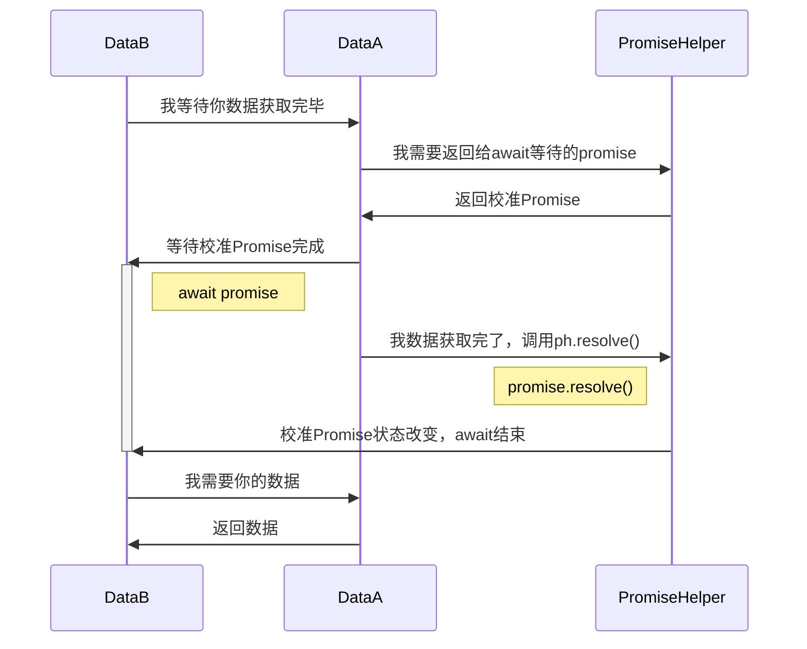

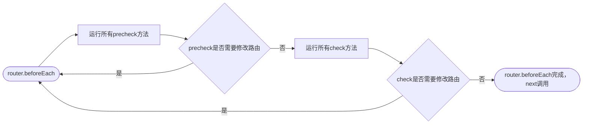

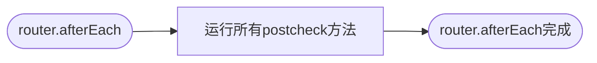

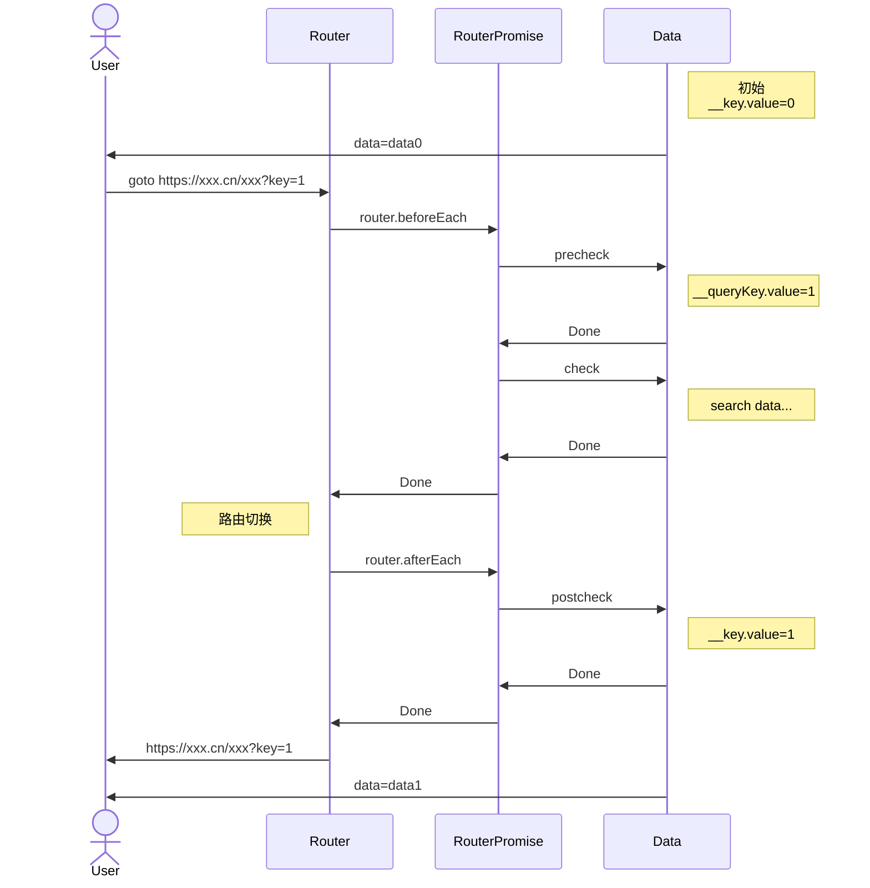

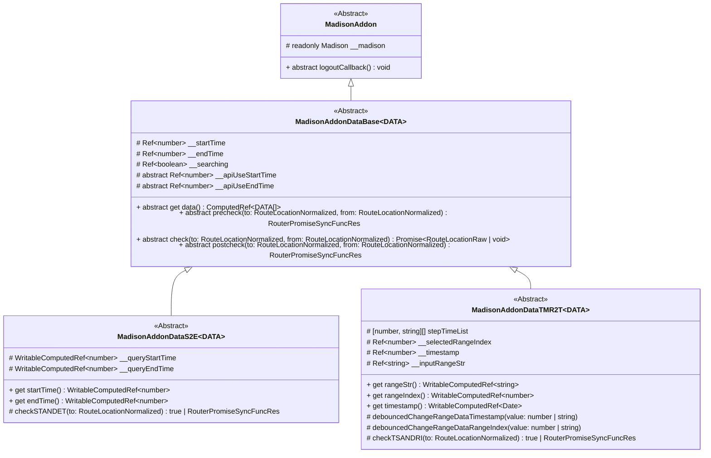

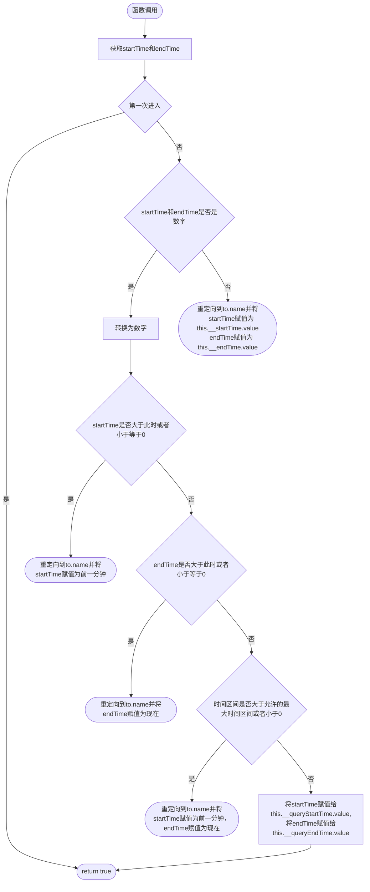

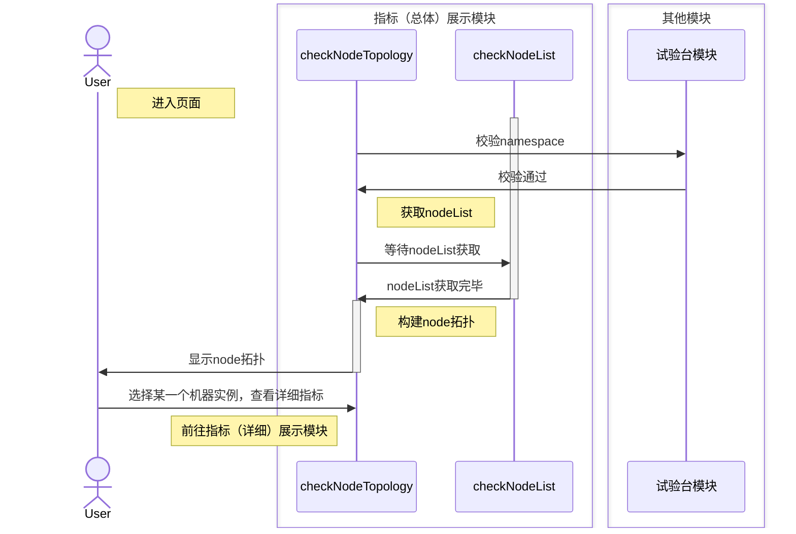

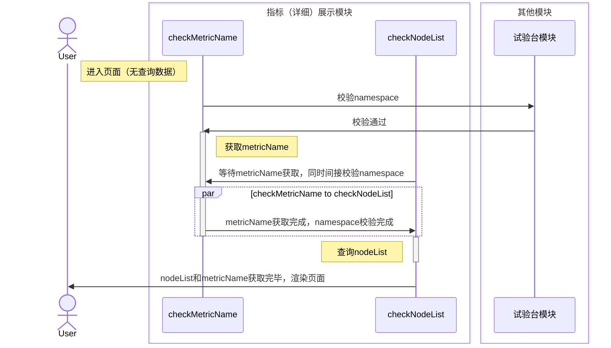

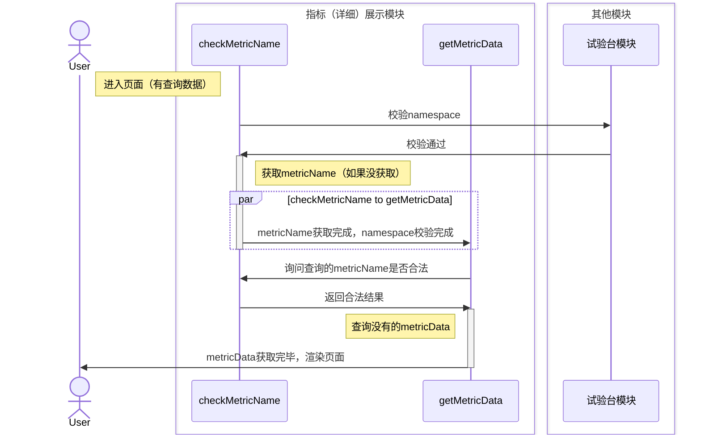

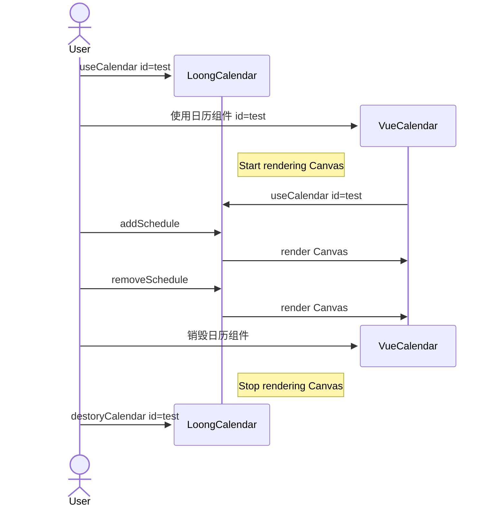
